# Getting started

This project uses Quarkus, the Supersonic Subatomic Java Framework.

If you want to learn more about Quarkus, please visit its website: https://quarkus.io/ .

## Tabla de Contenidos
1. [Requerimientos de entorno](#requerimientos-del-entorno)
2. [ActiveMQ Artemis Broker](#artemis-broker)
3. [Estructura del proyecto](#estructura-general-del-proyecto)
4. [Cambio de Arquitectura](#cambio-de-arquitectura)
5. [Correr la aplicación dev mode](#running-the-application-in-dev-mode)
6. [Correr la aplicación desde un Jar empaquetado](#packaging-and-running-the-application)
7. [Correr la aplicación desde una imágen Docker](#running-from-container)

## Requerimientos del entorno
**Desarrollo**
* JDK 17
* Maven 3.8.6

**Correr con contenedores locales**
* Docker >= 20

**Variables de entorno**
* ENV LANGUAGE= ' _en_US:en_ '
* ENV USER_TOKEN=' _RMIaJFyPTxG22xZOCBIhK6igjtZUmXO4YWeVwsW2M7O40eWATWTdtTug5DVeFDRf_ '
* ENV LOGIN_GET=' _JEAN_ '
* ENV PASSWORD_GET=' _123456_ '
* ENV USER_GET_INFO=' _NOMBRE @NOMBRE DE @DOMINIO_ '

** Dependencia con la siguiente aplicación **
* [Link ActiveMQ Artemis](https://hub.docker.com/r/apache/activemq-artemis)

## Artemis Broker

~~~console
docker pull apache/activemq-artemis
docker run -p 8161:8161 -p 61616:61616 -p 1883:1883 -p 5672:5672 -p 61613:61613 -p 5445:5445 apache/activemq-artemis
~~~

**Datos útiles:**
* Default-user:  _artemis_
* Default-password:  _artemis_
* [Link http://localhost:8161/console](http://localhost:8161/console)
* Las dos colas de este ejemplo no van a existir hasta que el **Producer** se levante, en este caso el **tps-simple-rest** el cual crear las queues al levantar.

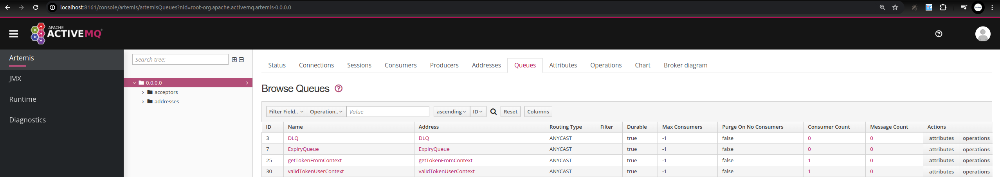
## Estructura general del proyecto
Se reemplazan los **XML** existentes en la versión **Karaf** por clases **Java** que instancian directamente las clases necesarias, se inyectan al contexto de **Quarkus**, cuando la aplicación **Camel** está levantando (en runtime) obtiene del contexto de Quarkus el la clase (instancia de _CxfEndPoint.java_ ) inyectándola en su **Registry** interno de components, entry-points y routes, esta es una estrategia propia de Camel.
Los dos únicos XML que restan en el proyecto son el pom.xml y tempalte del velocity heredados del proyecto anterior ( _./src/main/resources/vm_ ).

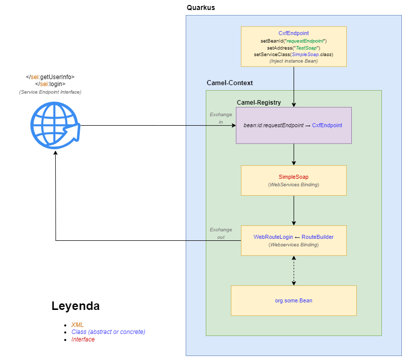

## Cambio de arquitectura

La aplicación legacy utiliza un componente llamado **direct-vm**, el cual permite que un **Registry** ingrese a múltiples **Camel-Contexts** (Jar's) y acumule Routes, y que la invocación a las mismas sea de forma síncrona, osea que espere resolver una ruta para continuar, en los esquemas actuales esta función no está soportada ya que con la implementación de los microservicios las aplicaciones setán separadas físicamente y no corren todas sobre un mismo Runtime como ocurría en el caso del Karaf. Este componente fue deprecado a partir del **Camel 3.x**, el equipo que mantiene **Camel** recomienda la implementación de **JMS** con el uso de algún **Broker**, en este ejemplo utilizamos **ActiveMQ Artemis** (La versión Red Hat es _AMQ 7.12_ ).

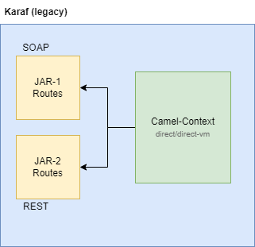

Como se comentó anteriormente, este esquema no sólo no es posible en aplicaciones actuales, sino que tampoco es soportado desde versiones superiores al Camel3.

* [Link Apache community](https://lists.apache.org/thread/qln6stnngdlq3qdjp2ssc64rvxfvhth9)
* [Link Quarkus Camel Team Github](https://github.com/apache/camel-quarkus/issues/4657)
* [Link Stackoverflow](https://stackoverflow.com/questions/51489663/apache-camel-and-blueprint-how-to-hit-a-route-within-another-bundle)

Para resolver esta problemática inherente a las arquitecturas actuales, desde el soporte directo de Camel proponen utilizar principalmente el patrón JMS. (Podría utilizarse REST, pero se expondrían servicios)

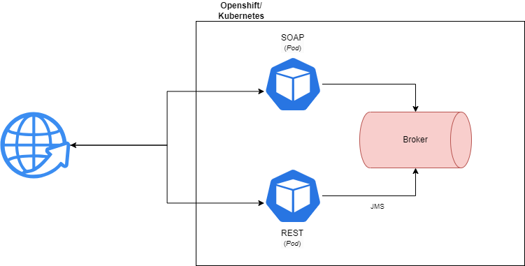
 
## Running the application in dev mode
Start quarkus-app desde el proyecto local para desarrollo:

```properties
mvn compile quarkus:dev
```
**Puntos a tener en cuenta de esta forma de ejecución:**
* Esta es la forma más sencilla de levantar el proyecto si por CLI se tiene instalado JDK 17 y Maven 3.8.6 (setear las variables de entorno también).
* Se puede prescindir de **mvn** y utilizar un IDE como **Eclipse** + **Quarkus Plugin**:
    * **Instalar Plugin** : Help -> _Eclipse Marketplace_ -> Buscar  " _Quarkus Tools_ ".
    * **Correr proyecto** Botón derecho en proyecto **root**,  _Run As_  ->  _Run configurations_  ->  _Quarkus Applicaction_ ->  _Seleccionar el proyecto_ ->  _Apply_  ->  _Run_
* En Visual Studio Code deben existir también para ejecutarlo en forma sencilla.

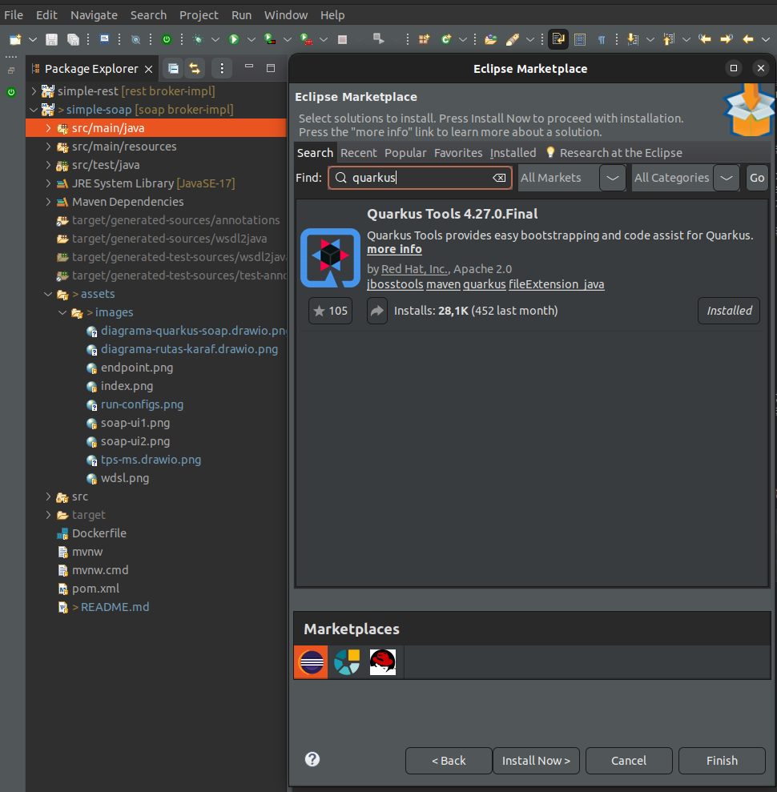

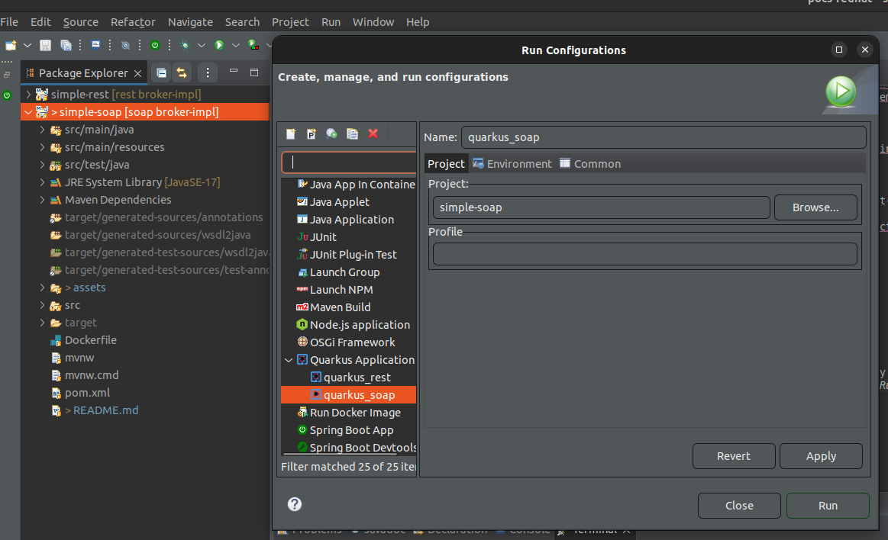

## Packaging and running the application
Empaquetar en **.jar** y correr desde local directo por JAR (no olvidar setear vars env)

```properties
mvn clean
mvn compile package
java -jar ./target/quarkus-app/quarkus-run.jar
```

## Running from container
Start **quarkus-app** en imágen basado en el *.jar* creado en el paso anterior, con lo cual _ante cualquier cambio hay que re ejecutar_ el **package** ya que el Dockerfile apunta al _file.jar_, en este caso el seteo de *variables* se puede hacer desde el mismo Dockerfile (incluso ya están presetadas) o desde ele comando **docker run** (no aplicado en este ejemplo). Esto termina creando una imágen para luego ser ejecutada.

```properties
docker build . -t tps/simple-soap:latest
docker run -p 8181:8181 --expose=61616 --network=host tps/simple-soap
docker image rm tps/simple-soap -f  (en caso tener que borrarla)
```

Correr de esta forma se basa en el **Dockerfile**, el mismo debe existir el **/root** del proyecto y no debe tener extensión, para construir imágen el **build**, para correr la misma el **run** y en caso de borrarla el **rm**.
El **publish** (-p) es necesario para publicar el puerto, el **expose** y el **network** para que desde el contenedor se pueda conectar a otro contenedor.

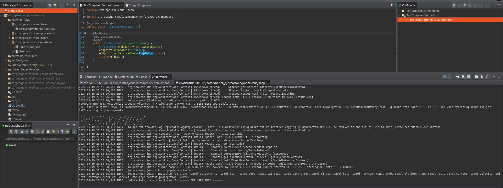

## WS description language

~~~url
http://localhost:8181/cxf/TestSoap?wsdl
~~~

## SOAP Services index

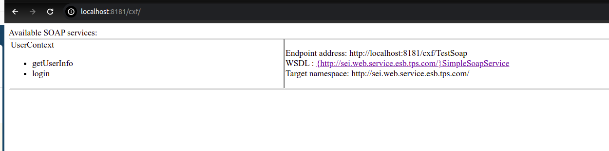

## WDSL

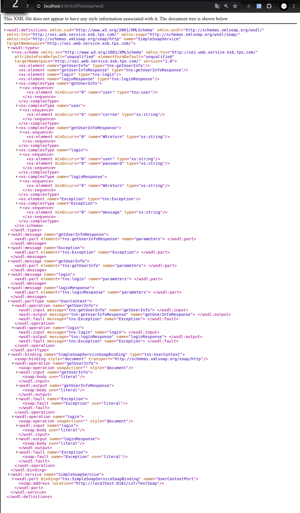


## Importar a SOAP-UI

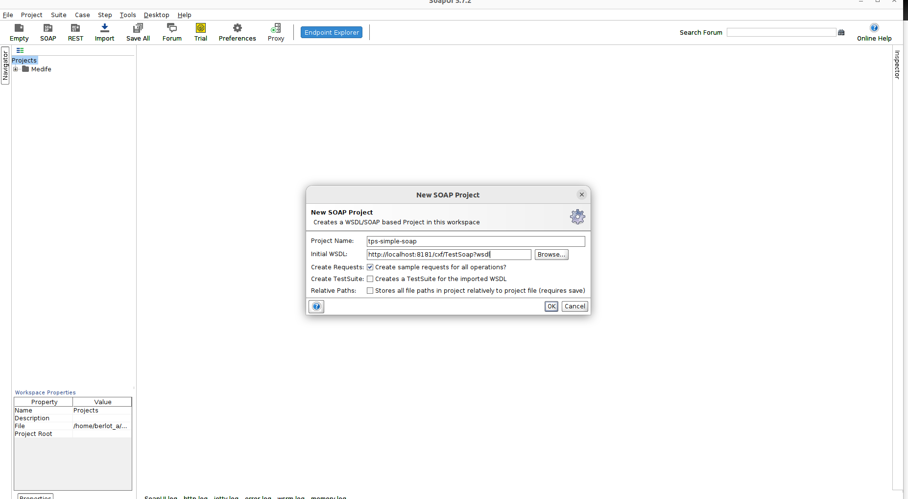

## Ejecutar requests

Es importante que el proyecto ya está levantado y con el servidor escuchando.

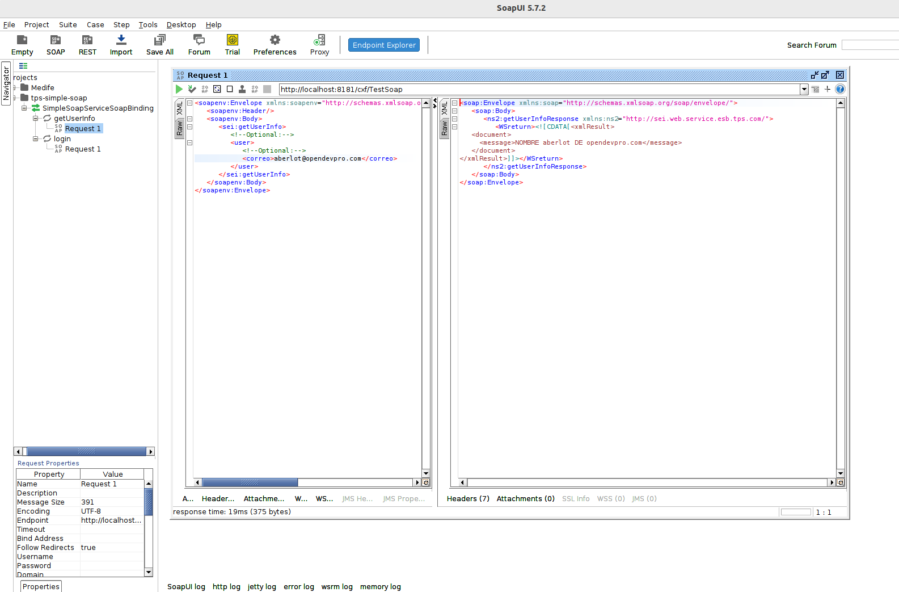

## Related Guides

- Camel Velocity ([guide](https://camel.apache.org/camel-quarkus/latest/reference/extensions/velocity.html)): Transform messages using a Velocity template
- Camel Core ([guide](https://camel.apache.org/camel-quarkus/latest/reference/extensions/core.html)): Camel core functionality and basic Camel languages: Constant, ExchangeProperty, Header, Ref, Simple and Tokenize
- RESTEasy Reactive ([guide](https://quarkus.io/guides/resteasy-reactive)): A Jakarta REST implementation utilizing build time processing and Vert.x. This extension is not compatible with the quarkus-resteasy extension, or any of the extensions that depend on it.

## Provided Code

### RESTEasy Reactive

Easily start your Reactive RESTful Web Services

[Related guide section...](https://quarkus.io/guides/getting-started-reactive#reactive-jax-rs-resources)
